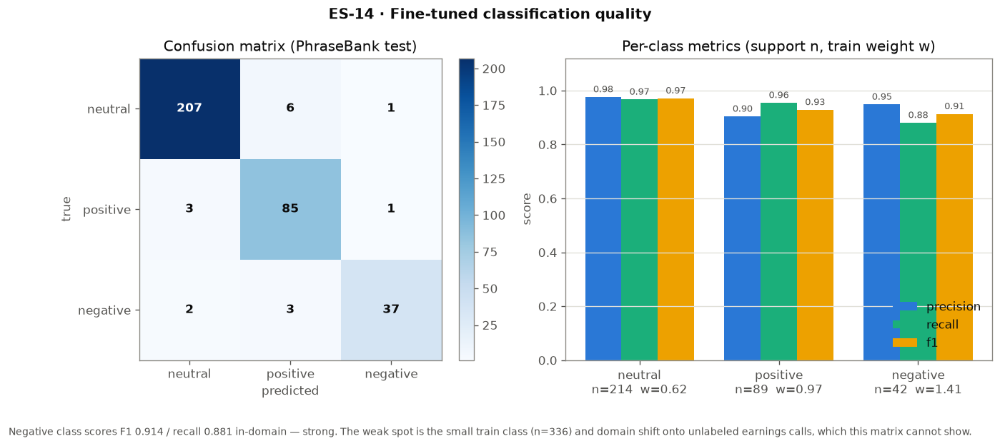
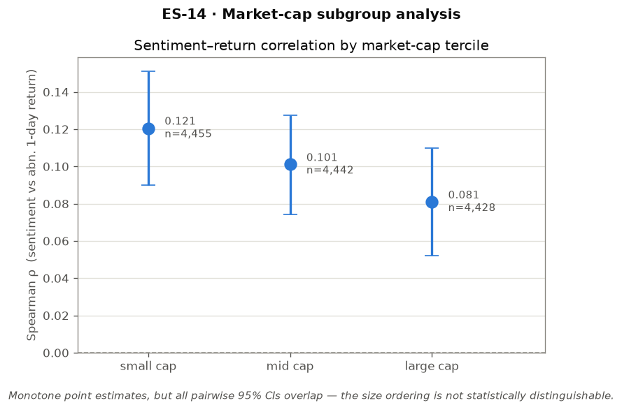
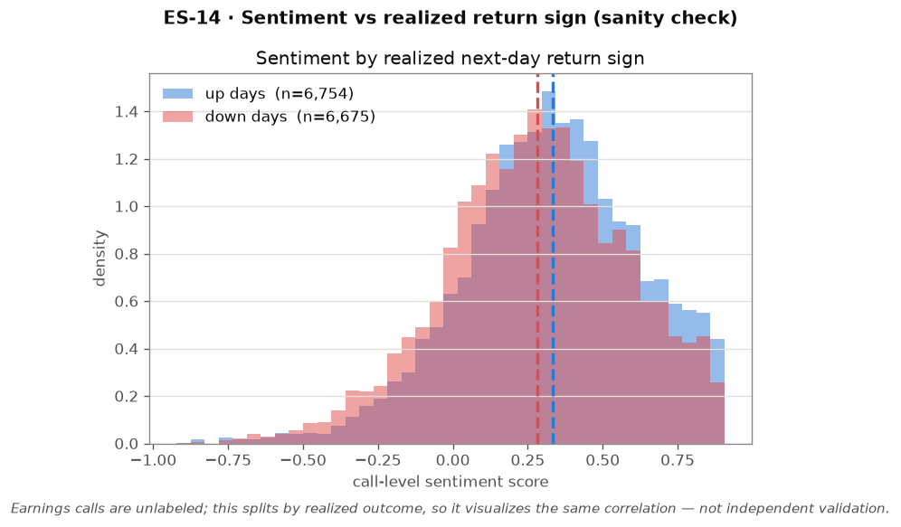

# earnings-signal

Fine-tuned FinBERT pipeline that extracts sentiment from earnings call transcripts and measures correlation with short-term stock returns.

## Overview
- Downloads and preprocesses 500+ earnings call transcripts
- Runs baseline FinBERT sentiment scoring
- Fine-tunes FinBERT on Financial PhraseBank
- Correlates sentiment scores with 1d/3d/5d forward returns

## Stack
Python · HuggingFace Transformers · PyTorch · yfinance · Parquet · MLflow

## Quickstart
```bash
pip install -r requirements.txt
make pipeline
```

## MCP Server
An [MCP](https://modelcontextprotocol.io) server exposes the pipeline as tools for Claude and other MCP clients:
- `list_covered_tickers` — discover which tickers/calls exist (counts, date range) with optional prefix/limit
- `get_ticker_sentiment_history` — persisted per-call sentiment for a ticker over an optional date range
- `compare_tickers` — most recent classification across several tickers
- `get_transcript` — the stored prepared transcript text for one call, by speaker section
- `classify_earnings_sentiment` — score arbitrary transcript text live against the fine-tuned checkpoint

Registered via [.mcp.json](.mcp.json); run with `.venv/bin/python -m src.mcp_server`. See [reports/mcp_server.md](reports/mcp_server.md) for details.

## Results
### Fine-tuned sentiment vs chance floor


The fine-tuned model's sentiment scores actually correlate with next-day stock returns (ρ ≈ +0.10), while an untuned baseline shows no real signal (ρ ≈ 0). That correlation holds up across different return windows (1-day and 5-day), so it's not a fluke of one time horizon.

### Fine-tuned classification quality


On held-out labeled data (Financial PhraseBank), the fine-tuned model correctly sorts sentences into positive/negative/neutral with 90%+ precision and recall across all three classes. The confusion matrix shows very few mix-ups between categories.

### Market-cap subgroup analysis


Breaking companies into small/mid/large market-cap groups, the sentiment-return correlation is a bit stronger for smaller companies than larger ones. However, the confidence intervals for each group overlap, so this difference isn't statistically conclusive yet.

### Sentiment by realized return sign


As a sanity check, sentiment scores are plotted separately for days the stock went up vs. down. Calls with higher sentiment skew slightly toward "up" days, consistent with the correlation results above (though this isn't independent proof, just a visual double-check).
