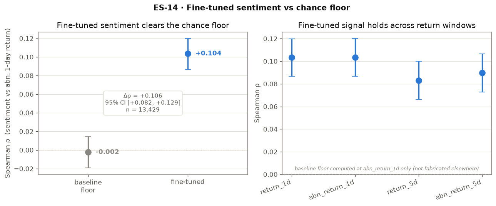

# Visualizations (ES-14)

## Purpose

The analysis layer (correlation [ES-08/12](finetuned_correlation_analysis.md),
fine-tuning [ES-09/10](finetune_analysis.md), market-cap subgroups
[ES-13](market_cap_subgroup_analysis.md)) had produced numbers but no figures.
ES-14 renders a small, deliberately **honest** set: each figure that reports a
correlation also draws its 95% clustered-bootstrap CI and `n`, so nothing reads as
more precise than it is. GitHub issue #14 framed this as "sentiment vs. returns"
scatter plots; the scope here is broadened to the four questions that actually
carry the project's claims.

All figures are produced by [`src/analysis/visualize.py`](../src/analysis/visualize.py)
and written to `results/`. Note on windows: the pipeline computes **1d and 5d**
returns only — there is no 3d window anywhere in the scored data, so the issue's
"3d" panel is intentionally absent.

## 1 · Fine-tuned sentiment clears the chance floor



The primary endpoint is the 1-day **abnormal** return (`abn_return_1d`,
market-subtracted). The randomly-initialized baseline head sits on zero
(ρ = −0.002, CI straddling the dashed reference line); the fine-tuned model clears
it (ρ = +0.104, CI [0.087, 0.120]), and the paired difference is Δρ = +0.106,
95% CI [0.082, 0.129] on n = 13,429 calls. The right panel shows the signal is not
window-cherry-picked — it holds across all four return windows. The baseline floor
was only computed at `abn_return_1d`, so no other-window baseline points are shown
(fabricating them would be dishonest).

## 2 · Fine-tuned classification quality


Confusion matrix and per-class precision/recall/F1 on the Financial PhraseBank test
split. **Read the negative class carefully:** it scores F1 0.914 / recall 0.881
*in-domain* — that is strong, not weak. The genuine limitation is the small negative
**train** class (n = 336, class weight ≈ 1.41) and the domain shift onto *unlabeled*
earnings calls — neither of which this test-set matrix can show. The per-class bars
are annotated with support (`n`) and the sqrt-inverse-frequency train weight (`w`)
so the imbalance is visible without implying a test-time weakness that isn't there.

The macro-F1-across-epochs training curves are not rebuilt here; see the existing
[`results/r2_learning_curves_full_finetune.png`](../results/r2_learning_curves_full_finetune.png)
and [`r2_learning_curves_linear_probe.png`](../results/r2_learning_curves_linear_probe.png).

## 3 · Market-cap subgroup


Per-tercile Spearman ρ at the primary window. The point estimates fall monotonically
from small (0.121) to large (0.081) caps — but **every pairwise 95% CI overlaps**
(all `differ = false`), so the size ordering is *not* statistically distinguishable.
The CIs and the caption are the guardrail against over-reading a size effect the
[subgroup analysis](market_cap_subgroup_analysis.md) already found inconclusive.

## 4 · Sentiment by realized return sign (sanity check)


Call-level sentiment split by the sign of the realized 1-day abnormal return.
Up-day calls (blue) sit slightly right of down-day calls (red) — the same positive
correlation from figure 1, viewed as two distributions with separated medians. This
is a **sanity check, not independent validation**: earnings calls are unlabeled, so
this splits by the realized outcome and is therefore a re-view of the same signal,
not a new one. This figure reads the gitignored scored parquet + index, so it
renders locally only (skipped, not errored, in CI).

## Reproduce

```bash
.venv/bin/python -m src.analysis.visualize
```

Figures 1–3 come from committed JSON (`results/correlation_results.json`,
`r2_finetune_metrics_full_finetune.json`, `subgroup_market_cap_results.json`) and
reproduce deterministically. Figure 4 needs the scored parquet + index; if they are
absent it is skipped with a message.

## Outputs

- `results/es14_baseline_ladder.png`
- `results/es14_classification_quality.png`
- `results/es14_market_cap_subgroup.png`
- `results/es14_sentiment_by_return_sign.png` (local-only)
